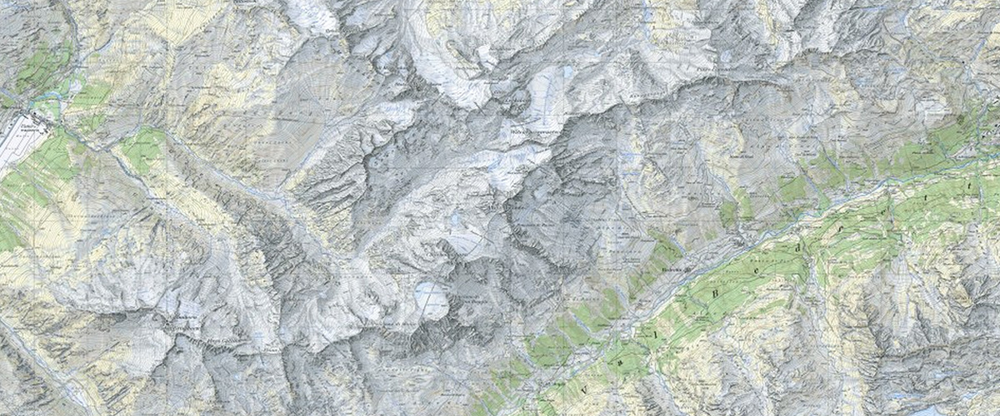

Switzerland has become known for beautiful cartography. It should come as no surprise (seeing that their nation is almost entirely mountainous) that their presentation of relief is especially effective. The vast changes in elevation presented in this relatively small country necessitate huge amounts of work and thought on the part of cartographers.

General Guillaume-Henri Dufour founded the Federal Office of Topography in 1838, which published its first map in 1844. After an extensive effort, the entirety of Switzerland had been mapped by 1864. Generally, the office began work on a new map immediately after they had finished the old map. Most of the time the country was using two maps at the same time, some areas having the older map and some areas having the newer map. Below are the three major maps that were completed and their use dates.

### Dufour Map

  The Dufour map was used from 1844 until 1939.

Although the first surveys of Switzerland took place as early as 1809, it wasn't until the Topographic Bureau was formed in 1838 that maps began to be published. The Dufour Map was initially reproduced by intaglio. It was monochromatic until 1908 when a single spot color was added.

The Dufour Map (named after the first leader of the Office of Topography, General Guillaume-Henri Dufour) was finished in 1864, and a year later, its namesake General retired and a new map was begun.

### Siegfried Map

  The Siegfried map was used from 1870 until 1949.

Its publication was begun by the Federal Topographic Bureau under Hermann Siegfried, and continued from 1870 to 1922.

Another significant departure from the Dufour Map was the presence of contours to symbolize the relief (a granularity of 10 metres (33 ft) for the 1:25 000 pages, and 30 metres (98 ft) for the 1:50 000 pages). In addition, three colors were used directly for printing, whereas the Dufour Map was initially monochrome. On the Siegfried Map, the colours used were brown for the contour lines on vegetated terrain, blue for water and contour lines on glaciers, and black for the rest.

### National Maps

  The National maps were used from 1938 and are still used today.

The National Maps of Switzerland are a set of official map series designed, edited and distributed by Swisstopo, the Swiss Federal Office of Topography. Each map series is based on an oblique, conformal, cylindrical projection (Mercator projection), with a Swiss Coordinate system (CH1903 +). All maps are updated in a complete cycle of about six years.
In 1938, the Federal Office of Topography started issuing new map sheets, which were intended to succeed the old Dufour and Siegfried Maps. They first appeared in 1:50,000 scale, and from 1952 also in 1:25,000 scale. In addition, further generalisations were made in smaller scales. In each scale, the whole of Switzerland was covered. In 1979, with the issuance of the last 1:25,000 scale sheet, the work was completed.